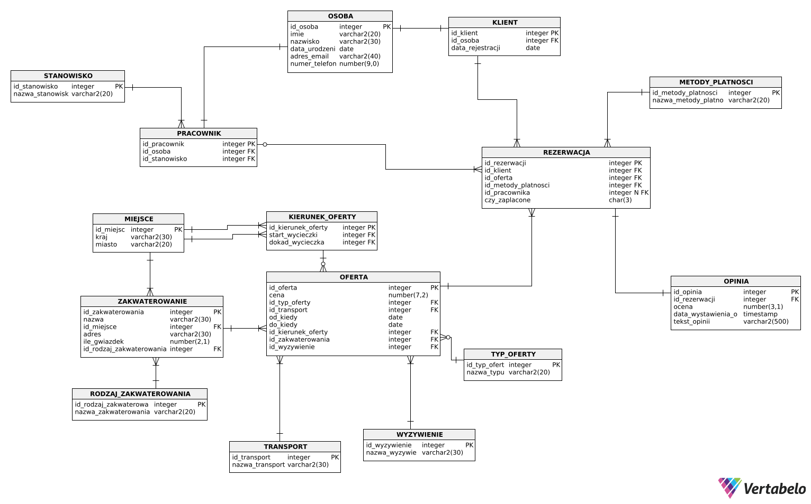

# Travel-Agency-Database
This project is a comprehensive relational database designed for a travel agency. It manages various aspects of the business operations, including tour packages, customer reservations, employee commissions, and post-trip feedback. 

The database is structured to handle complex business logic, ensuring data integrity across customers, employees, and travel offers.

Key Features & Business Logic
* **Tour Management:** Handles different types of offers (standard, last-minute, cruises), including pricing, start/end dates, and destinations.
* **Customer & Reservations:** Tracks customer registrations, bookings, payment methods, and payment statuses.
* **Accommodation & Transport:** Manages available transportation options and lodging details.
* **Reviews System:** Allows customers to leave ratings and text comments after completing a tour.
* **Employee Tracking:** Manages staff roles and tracks employee-assisted bookings to calculate bonuses and commissions.
* **Location Tracking:** Stores geographic data for departure points, destinations, and hotel locations.

Database Schema (ERD)

*> The Entity-Relationship Diagram was designed using Vertabelo.*

## Repository Structure
* `create_tables.sql` - DDL scripts to create all tables, constraints, and relationships (Primary/Foreign Keys).
* `all_data_used.sql` - DML scripts containing sample data (INSERT statements) to populate the database for testing.
* `all_SELECTS.sql` - A collection of SQL queries demonstrating data retrieval, joining multiple tables, and aggregations.

## Technologies & Skills
* SQL (Data Definition & Data Manipulation)
* Relational Database Design
* Vertabelo (Data Modeling)
